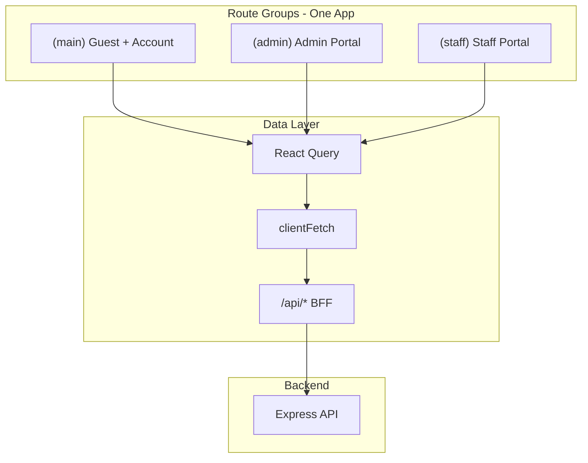
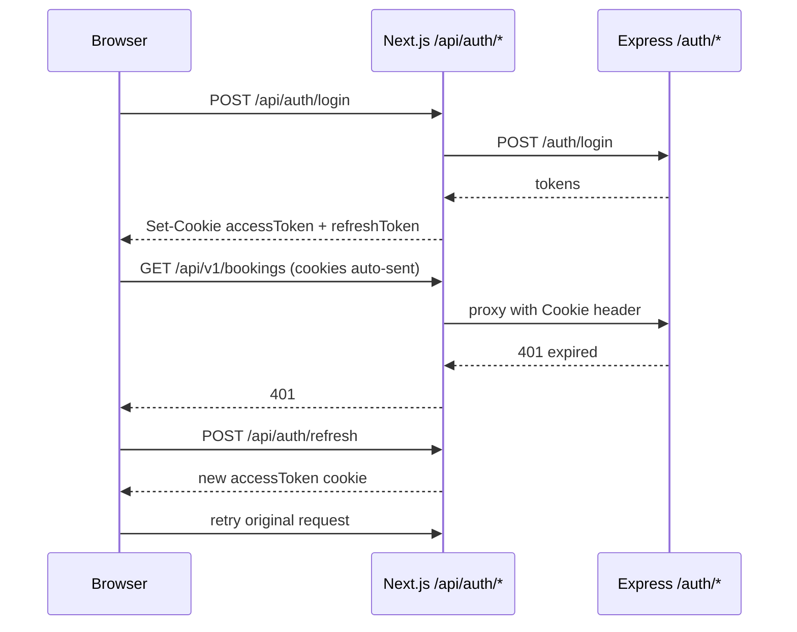

# Guesthouse Frontend — Architecture Reference

## Architecture overview



## Query factory pattern

```typescript
// features/admin/queries.ts
import { queryOptions } from '@tanstack/react-query';
import { clientFetch } from '@/lib/api/client';
import type { Property, PaginatedResponse } from '@/types';

export const adminQueries = {
  properties: () =>
    queryOptions({
      queryKey: ['admin', 'properties'] as const,
      queryFn: () => clientFetch<PaginatedResponse<Property>>('/v1/?limit=100'),
    }),
};
```

```typescript
// app/(admin)/admin/properties/page.tsx
'use client';
import { useQuery } from '@tanstack/react-query';
import { adminQueries } from '@/features/admin/queries';

export default function PropertiesPage() {
  const { data, isLoading } = useQuery(adminQueries.properties());
  // ...
}
```

## Mutation + invalidation pattern

```typescript
// features/booking/mutations.ts
import { mutationOptions } from '@tanstack/react-query';
import { clientFetch } from '@/lib/api/client';

export const bookingMutations = {
  cancel: () =>
    mutationOptions({
      mutationFn: ({ id, reason }: { id: string; reason?: string }) =>
        clientFetch(`/v1/bookings/${id}/cancel`, {
          method: 'POST',
          body: JSON.stringify({ reason }),
        }),
    }),
};
```

```typescript
// In a page after mutation success:
import { useMutation, useQueryClient } from '@tanstack/react-query';
import { bookingMutations } from '@/features/booking/mutations';

const queryClient = useQueryClient();
const cancel = useMutation({
  ...bookingMutations.cancel(),
  onSuccess: () => queryClient.invalidateQueries({ queryKey: ['bookings'] }),
});
```

## Auth flow (httpOnly cookies)



Key files:

- `app/api/auth/login/route.ts` — sets cookies
- `lib/api/client.ts` — auto-refresh on 401
- `middleware.ts` — gate protected routes

## API route map (BFF)

| Client call                 | Next.js route          | Backend target                  |
| --------------------------- | ---------------------- | ------------------------------- |
| `clientFetch('/v1/...')`    | `/api/v1/[...path]`    | `BACKEND_URL/api/v1/...`        |
| `clientFetch('/admin/...')` | `/api/admin/[...path]` | `BACKEND_URL/admin/...`         |
| `fetch('/api/auth/login')`  | `/api/auth/login`      | `BACKEND_URL/auth/login`        |
| `uploadFile(type, file)`    | `/api/upload/[type]`   | `BACKEND_URL/api/v1/upload/...` |

## Socket invalidation map

| Socket event                | Invalidated query keys                |
| --------------------------- | ------------------------------------- |
| `booking:updated`           | `bookings`, `front-desk`              |
| `room:status-changed`       | `rooms`, `housekeeping`, `front-desk` |
| `housekeeping:task-updated` | `housekeeping`                        |

Source: `providers/SocketProvider.tsx`

## Query key conventions

| Domain       | Key prefix     | Example                             |
| ------------ | -------------- | ----------------------------------- |
| Booking      | `bookings`     | `['bookings', 'detail', id]`        |
| Properties   | `properties`   | `['properties', 'slug', slug]`      |
| Admin        | `admin`        | `['admin', 'audit-logs', params]`   |
| Front desk   | `front-desk`   | `['front-desk', 'arrivals', date]`  |
| Housekeeping | `housekeeping` | `['housekeeping', 'tasks', params]` |
| Rooms        | `rooms`        | `['rooms', propertyId]`             |
| Availability | `availability` | `['availability', params]`          |

## New page template

```typescript
// app/(admin)/admin/widgets/page.tsx
'use client'

import { useQuery } from '@tanstack/react-query'
import { adminQueries } from '@/features/admin/queries'
import { Card, CardContent, CardHeader, CardTitle } from '@/components/ui/card'
import Spinner from '@/components/Spinner'

export default function WidgetsPage() {
  const { data, isLoading, error } = useQuery(adminQueries.properties())

  if (isLoading) return <Spinner />
  if (error) return <p>Failed to load widgets.</p>

  return (
    <Card>
      <CardHeader><CardTitle>Widgets</CardTitle></CardHeader>
      <CardContent>{/* render data */}</CardContent>
    </Card>
  )
}
```

## features/ module layout

```
features/{domain}/
├── queries.ts       # queryOptions exports
├── mutations.ts     # mutationOptions exports (if writes exist)
└── components/      # domain-specific UI (optional)
```

When adding a new domain:

1. Create `features/{domain}/queries.ts`
2. Add page under the correct route group
3. Import from `@/features/{domain}/queries` — not `@/queries/`

Legacy shims at `queries/` and `mutations/` re-export from `features/` for backward compatibility. New code must import from `features/` directly.

## Scale thresholds (when to reconsider monolith)

Stay monolithic unless **several** of these apply:

- 3+ independent frontend teams with conflicting release schedules
- 100+ routes with heavy domain-specific dependencies
- Guest bundle bloated by admin/staff code (measure first)
- Personas need independent deploy targets (CDN vs VPN-only)
- Different frameworks per persona

At ~117 files and 33 routes, monolithic is the correct architecture.
